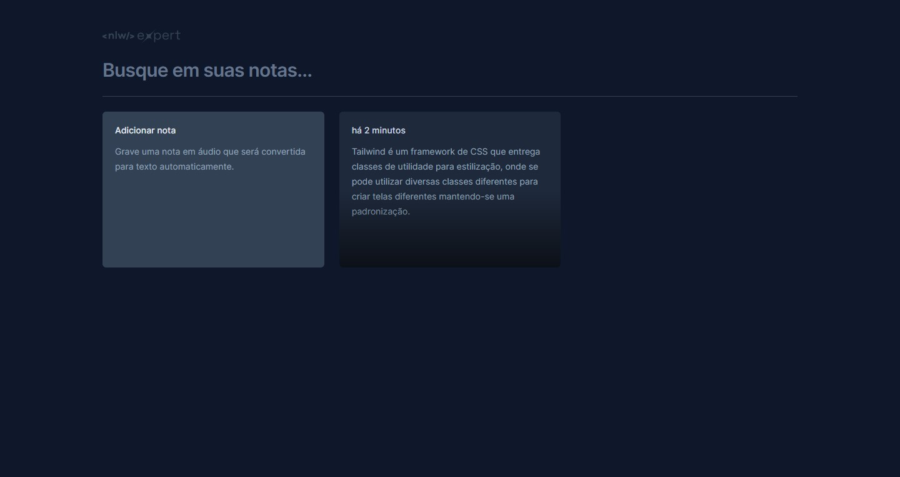

 

  <h3 align="center">NLW - Expert Notes</h3>

  

    App de criação de notas
     
  

  
Sumário

  <ol>
    <li>
      <a href="#sobre-o-projeto">Sobre o projeto</a>
      <ul>
        <li><a href="#feito-com">Feito com</a></li>
      </ul>
    </li>
    <li>
      <a href="#baixando-o-projeto">Baixando o projeto</a>
    </li>
  </ol>

## Sobre o projeto

  

 

Este projeto permite aos usuários criarem anotações por meio do próprio teclado e por meio de voz utilizando a API SpeechRecognition

Funcionalidades:
* Criação de notas por texto
* Criação de notas por reconhecimento de voz
* Filtragem de notas

(<a href="#readme-top">voltar ao início</a>)

### Feito com

* [![React][React.js]][React-url]
* [![Tailwind][Tailwind]][Tailwind-url]
* [![Vite][Vite]][Vite-url]

(<a href="#readme-top">voltar ao início</a>)

### Baixando o projeto

Abaixo estão algumas orientações para baixar o projeto localmente.

- Requisitos:
  - Visual Studio Code
  - Node.js

1. Baixe o projeto ou clone o repositório.

2. Abre o projeto usando o VS Code e, usando o terminal escreva o comando `npm install`.

3. Agora no terminal escreva o comando `npm run dev`.

4. Pronto, o sistema está funcionando, abra este link http://localhost:5173/ em um navegador.

(<a href="#readme-top">voltar ao início</a>)

<!-- MARKDOWN LINKS & IMAGES -->
<!-- https://www.markdownguide.org/basic-syntax/#reference-style-links -->

[React.js]: https://img.shields.io/badge/React-20232A?style=for-the-badge&logo=react&logoColor=61DAFB
[React-url]: https://reactjs.org/

[Tailwind]: https://img.shields.io/badge/tailwind-131417?style=for-the-badge&logo=tailwindcss&logoColor=#06B6D4
[Tailwind-url]: https://tailwindcss.com/

[Vite]: https://img.shields.io/badge/Vite-20232A?style=for-the-badge&logo=vite&logoColor=#646CFF
[Vite-url]: https://vitejs.dev/